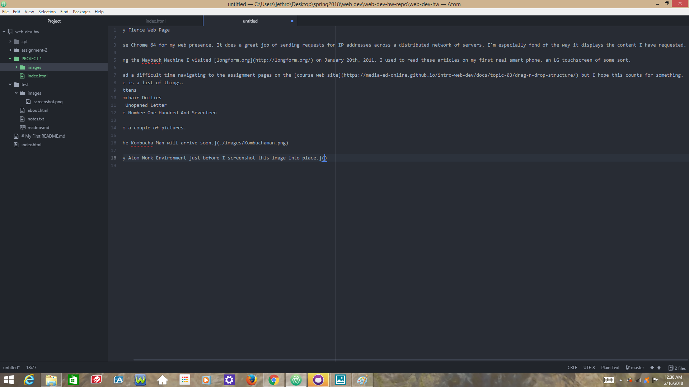

# My Fierce Web Page

I use Chrome 64 for my web presence. It does a great job of sending requests for IP addresses across a distributed network of servers. I'm especially fond of the way it displays the content I have requested.

Using the Wayback Machine I visited [longform.org](http://longform.org/) on January 20th, 2011. I used to read these articles on my first real smart phone, an LG touchscreen of some sort.

I had a difficult time navigating to the assignment pages on the [course web site](https://media-ed-online.github.io/intro-web-dev/docs/topic-03/drag-n-drop-structure/) but I hope this counts for something.
Here is a list of things in no particular order.
-Kittens
-Armchair Doilies
-An Unopened Letter
-The Number One Hundred And Seventeen

Also a couple of pictures.

