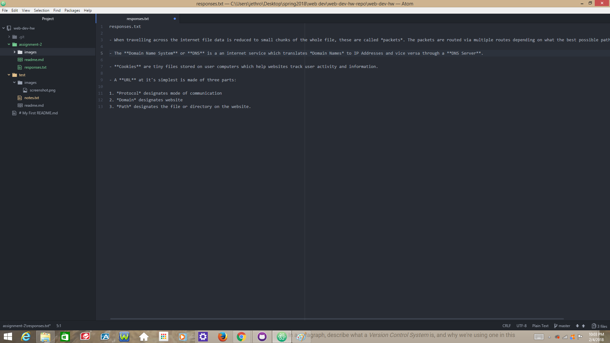

# Assignment 2

A *Version Control System* tracks changes as they happen allowing the user to view their progress and reducing task overlap when there are multiple authors of web documents.

[My Responses](./responses.txt)

I usually finish the readings before I begin the assignment. This week I received *HTML & CSS* **by John Druckett** in the mail and I fell into an **HTML** trance, just idly flipping pages until I got to *citing* which reminded me that I had an assignment due.
Once I sat down and began the tutorials I found this to be an interesting lesson in the management of files. It's very satisfying when the paths all work.

