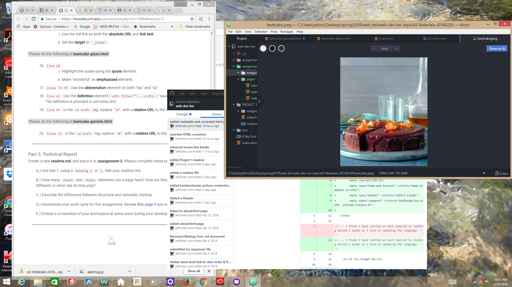

## *Dr. StrangeGarnish Or How I Learned to Love the BeetCake*

Ideally a page would only have one <head> and one <body> element. I suppose you could have multiple <head> and <body> elements but it might confuse some browsers.

Structural elements place content on the page, Semantic elements add meaning but do not affect structure.

- I think my **biggest** hurdle so far is remembering that the *assignment* is in the *moodle shell* whereas the *content* is in the *website*. If I can keep that in mind next week I won't be scrambling to find out what the directions are.
- The second biggest, or **mediumest** hurdle was getting over my aversion to sweet beet recipes.  Give me a nice cold bowl of *Borscht* any day.
- The third biggest, or **smallest** hurdle was that moment when I forgot that image files needed to be transferred to the image file *directly* and can not be saved there in **Atom**.

 
