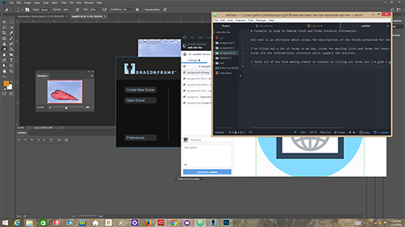

# **Formalin is used to Embalm Flesh and Forms Preserve Information**

Alt text is an attribute which allows for descriptions of the fields presented for the use of Hypertext Readers and Curious Coders.

I've filled out a lot of forms in my day. Forms for mailing lists and forms for taxes and forms for registration for classes ...
Forms are the informational structure which support the Internet.

I found all of the form making almost as tedious as filling out forms but I'm glad I got this done in time, typical form stuff ...

 
