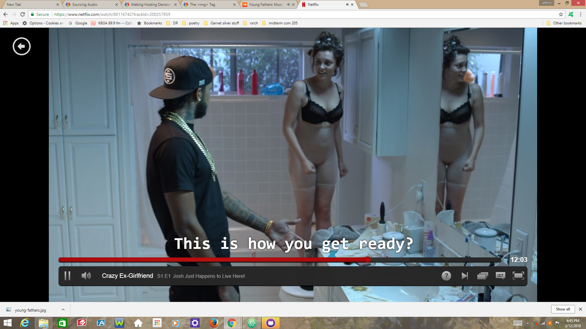

# I frame, You frame, We all Frame with **iframe**

-The **div element** groups content in a block
-The **span element** allows developers to style specific content within blocks
-The **id attribute** applies a unique identifier to a specific element
-The **class attribute** groups similar elements together with a unique identifier

Using **third party** media rather than **self hosted** media cuts down on the bandwidth used by your site. If your media is exclusive to your site you might consider hosting it yourself. If you are hosting your own media it is important to provide multiple formats so that it is accessible by all browsers.

I spent quite a bit of time reading up on **CSS** as I have some experience with this aspect of **HTML**. I spent most of the day napping while watching *Crazy Ex Girlfriend* on Netflix then I drank some coffee and started coding.

 
