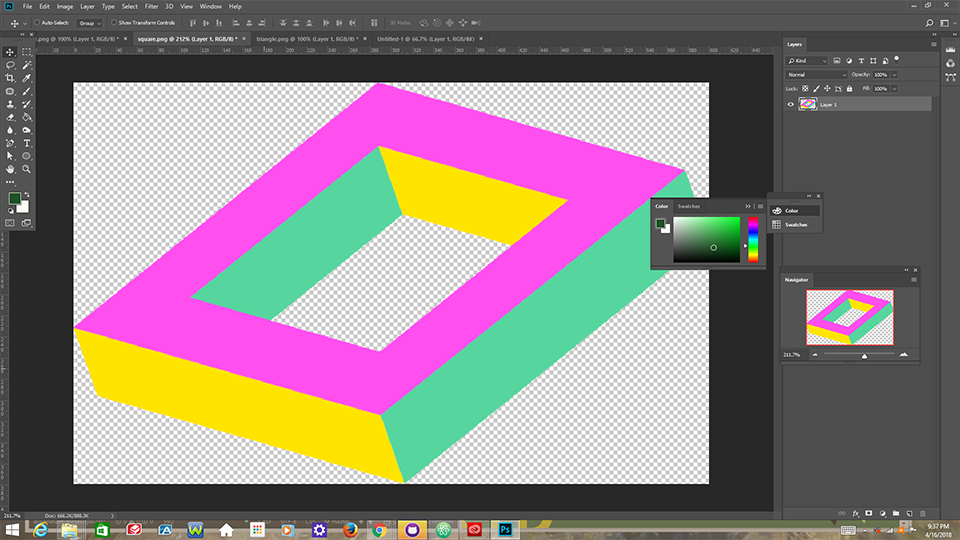

# CSS and the difference between legibility and art

I chose to use graphics from the 80's because that was the decade when I first started paying attention to design. The 80's were about sharp contrasts and the simple placement of graphics so I went for a simple design.

- background color: #336633, an olive with acidic undertones
- text color 1: rgb(255, 79, 239) a hot violet which I took from the square illustration pictured in the screenshot.
- text color 2: rgb(255, 228, 0) a mild yellow which worked well against the BG and the violet, also eyedroppered from the square illustration.

I found the positioning of text to be very frustrating and I lost quite a few hours to attempting to break the leftward pull of our anglo-centric, left-to-right biased markup environment. I have given up, clearly there is something I am missing.

