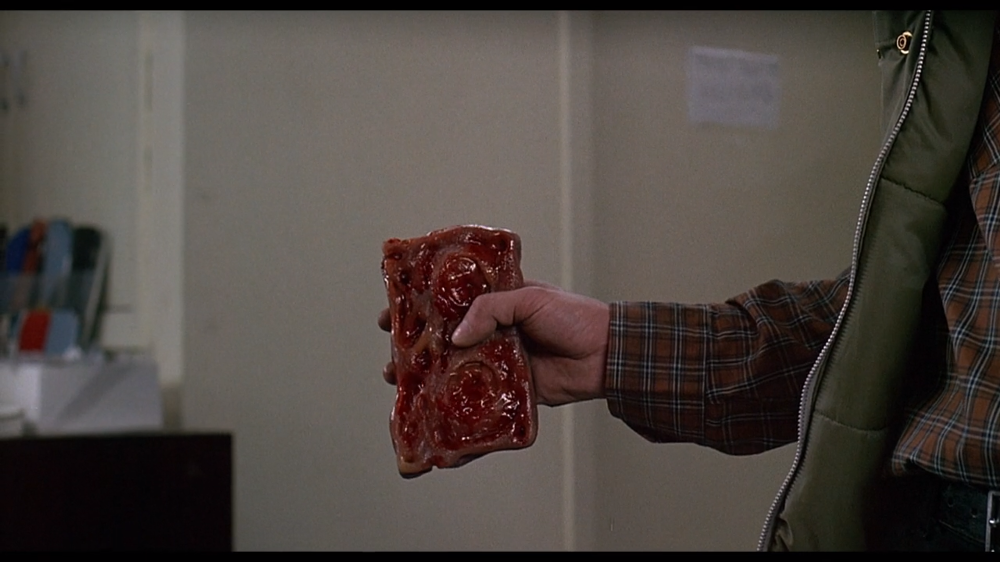

# Underwater

I must admit that I have been extremely busy this past few weeks, my apologies for tardiness. This time around I went with a maritime theme, light blues and grays designed to convince the reader that they were indeed 20,000 leagues under the sea.

 *Fallback fonts* or *Font stacks* are necessary because each browser recognizes several different sets of of fonts but no browser recognizes all of the fonts. Thus the necessity for a *fallback*.

 Most of this assignment was spent in a kind of semester end paralysis. It loomed at me like an under sea apparition, an indistinct but perilously huge beast just out of sight. I have spent the last week rewatching *Videodrome* and I fear that I have been infected with some violent signal of summer.

 
